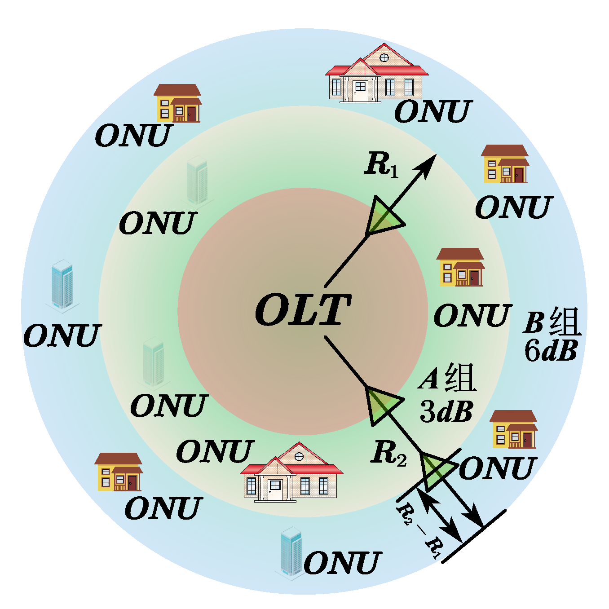
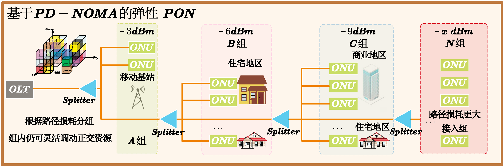
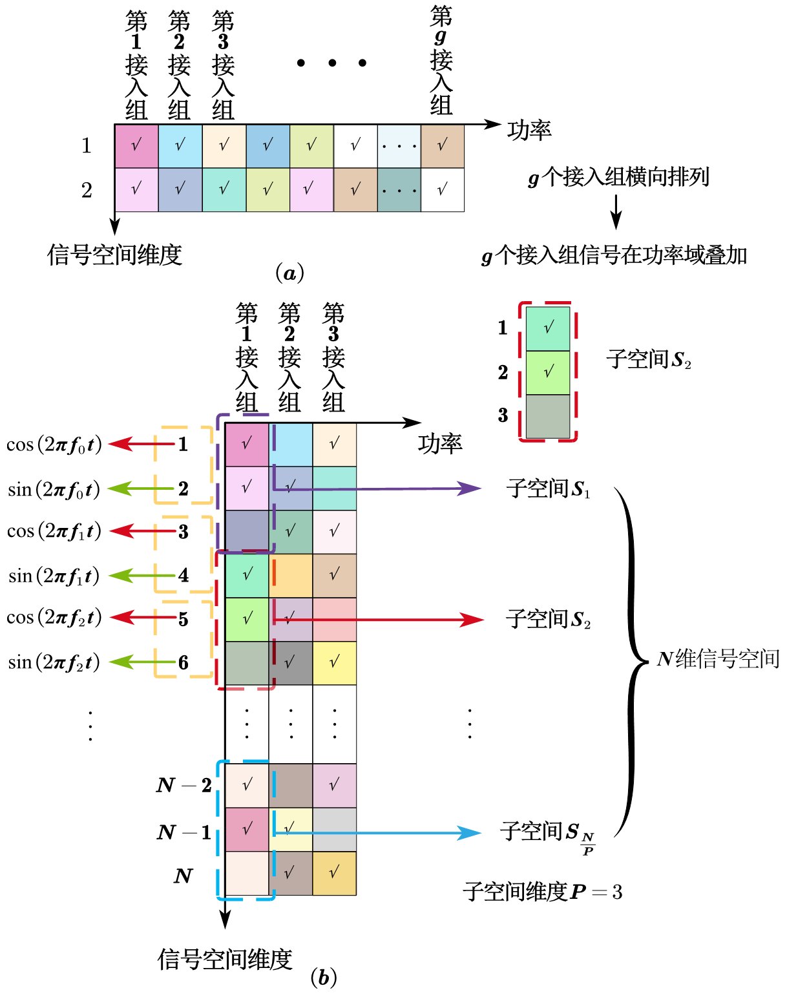
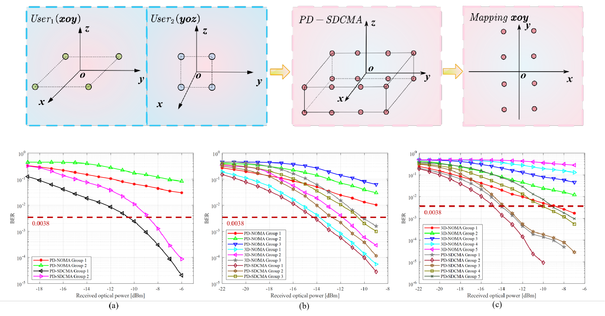
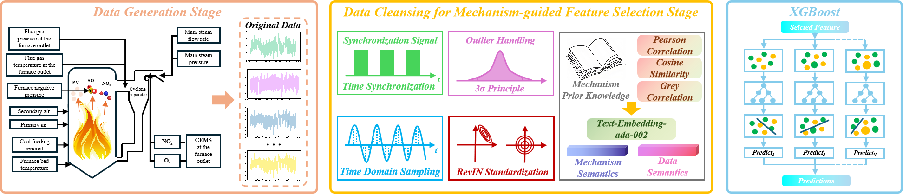
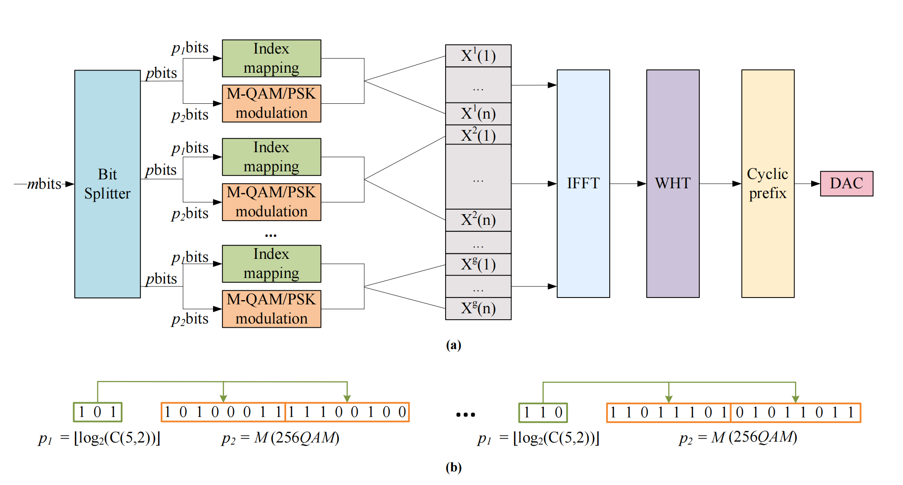
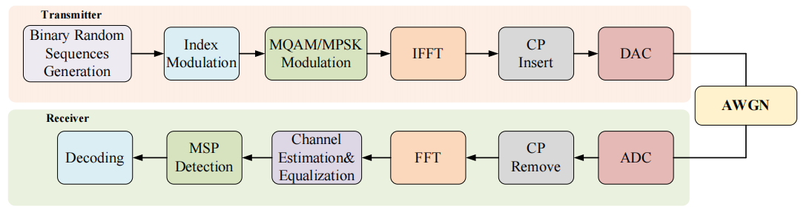
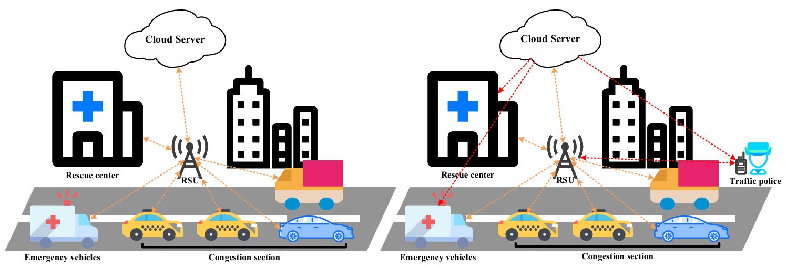

#个人信息展示项目 README

## 项目概述
这是一个 Vue 项目，用于展示连宇昊个人的教育背景、研究方向、项目经历、科研成果以及个人荣誉等信息。项目以网页的形式呈现，方便他人了解连宇昊的学术和专业成就。

## 个人信息
- **姓名**：Yuhao Lian
- **教育背景**：
  - 2024 年 6 月，在中国重庆的重庆邮电大学通信与信息工程学院获得工学荣誉学士学位。
  - 目前，正在中国杭州的浙江大学攻读电子信息专业硕士学位。
- **联系方式**：
  - **电话**：+86 18334564608
  - **电子邮箱**：Yuhao_lian@zju.edu.cn、Lianyuhao@ieee.org
  - **地址**：Zhejiang University, Hangzhou, China
- **在线平台**：
  - [GitHub](https://github.com/YuhaoLian)
  - [Google Scholar](https://scholar.google.com/citations?hl=zh-CN&user=dlzoXeQAAAAJ)
  - [个人简历（CV）](./src/assets/data/CV_YuhaoLian.pdf)

## 研究方向
- **B5G/6G 无线通信**：OFDM-IM 通信系统、面对更多接入设备的非正交多址接入技术。
- **低空经济下的反无人机技术**：基于深度学习与信号处理的射频识别。

## 项目经历
1. **面向更多接入设备的非正交多址接入技术（2023 年 1 月 - 至今）**
    - 针对大规模接入的无线场景与需要更多接入组数的灵活 PON 场景。
    - 为降低串行干扰，基于信号的施密特正交化提出了星座稀疏叠加的非正交接入方式，从理论上突破传统的接入设备极限。
    - 通过 Matlab 与 VPI 联合仿真 与 AWG 与 DPO 实机实验得到验证。
    - 相关图片：
      - 
      - 
      - 
      - 
2. **基于机器学习的热电机组氮氧化物排放动态预测（2024 年 10 月 - 至今）**
    - 为响应双碳目标，对 CFB 中的 NO_x 的预测进行建模，解决出口 NOx 浓度测量滞后性大的问题。
    - 在语义嵌入的基础上提出了 AML-XGBoost-Ts 模型，实现 NOx 浓度及时预测的同时提升 XGBoost 数据建模的可解释性。 
    - 构建基于 SHAP 值的可解释性分析框架，实现预测结果验证。
    - 相关图片：
3. **Digital Communications—OFDM-IM（2022 年 10 月 - 2024 年 1 月）**
    - **导师**：[Prof. Justin Coon](https://eng.ox.ac.uk/people/justin-coon/)（Oxford University）
    - 针对 OFDM-IM 系统，在不同参数设置下展开深入仿真研究，评估系统性能。
    - 采用 WHT（Walsh-Hadamard Transform）与双 WHT 技术，降低 OFDM-IM 系统的高 PAPR 问题。
    - 分析与改进现有 OFDM-IM 检测算法，提出基于功率阈值的低信噪比检测方法，增强系统抗干扰能力。
    - 相关图片：
      - 
      - 
4. **基于数字孪生模型的城市应急车辆路线仿真研究（2022 年 5 月 - 2024 年 4 月）**
    - 针对特种车辆（救护车/消防车等）在城市拥堵环境中的通行效率问题，主导设计基于实时交通态势的智能调度系统。
    - 构建“拥堵指数-警力效能”双目标优化模型，融合实时路况数据、警力分布热力图和应急事件等级，运用启发式算法实现道路节点通行能力与警员处置能力的动态适配。
    - 相关图片：

## 科研产出
1. **学术会议（Conference Papers）**
    - **Y. Lian**, Z. Li, Y. Li and  C.Liu, "Power Domain Sparse Dimensional Constellation Multiple Access (PD-SDCMA): A Novel PD-NOMA for More Access Users", <em>2025 Vehicular Technology Conference fall (VTC-Fall)</em> (Submission) 
    - **Y. Lian**, X. Deng, X .Dou and X .Han, "PowerDomain SparseDimensional Constellation Multiple Access (PD-SDCMA) for Enabled Flexible PONs", <em>2025 IEEE/CIC International Conference on Communications in China (ICCC)</em> (Submission) 
    - **Y. Lian**, M. Ying, S. Wang and Y. Wang, "An Efficient Maximum Subcarrier Power Detection Scheme for OFDM-IM Systems," <em>2023 International Wireless Communications and Mobile Computing (IWCMC)</em>, Marrakesh, Morocco, 2023, pp. 258-263
    - **Y. Lian**, M. Ying, S. Wang and Y. Wang, "An Efficient Fast Walsh-Hadamard Transform Based OFDM-IM Scheme with Lower PAPR," <em>2023 Wireless Telecommunications Symposium (WTS)</em>, Boston, MA, USA, 2023, pp. 1-6 
    - **Y. Lian**, X. Bi, P. Zhao and Y. Jiang, "A Research on Modulation and Detection in OFDM-IM System," <em>2023 3rd Asia-Pacific Conference on Communications Technology and Computer Science (ACCTCS)</em>, Shenyang, China, 2023, pp. 27-33 
    - **Y. Lian**, Y. Wang, X. Lin. "Double Walsh-Hadamard Transform for Improved Efficiency in OFDM-IM."  <em>Proceedings of the 12th International Conference on Communications, Circuits, and Systems (ICCCAS)</em>, Lecture Notes in Electrical Engineering, vol 1193. Springer, Singapore.  
    - X. Deng, **Y. Lian**, J. Lu, H. Liu, Y. Pan and H. Chen, " <em>Emergency Vehicle Road Congestion Evacuation System Based on the Internet of Vehicles," 2023 6th International Conference on Electronics Technology (ICET)</em>, Chengdu, China, 2023, pp. 517-522
    - Y. Wang and **Y. Lian**, "MLFEN: Multi-scale Long-Distance Feature Extraction Network,"" <em>Lecture notes in computer science</em>, pp. 189–199, Jan. 2023  
    - Y. Wang and **Y. Lian**, "ZPF-DLSTM: An Efficient Deep Network with Low Time Latency," <em>Studies in computational intelligence</em>, pp. 73–85, Jan. 2024  
2. **期刊（Journal Articles）**
    - Y. Wang, **Y. Lian**, M. Ying and S. Wang, "Attention Multilayer Perceptron Fusion Network," in <em>IEEE Access</em>, vol. 11, pp. 83580-83588, 2023
3. **专利（Patents）**
    - **连宇昊**,邓鑫茂,卢嘉煜,等.一种基于车联网的紧急车辆道路拥堵疏散系统:CN202310596896.3[P].CN116631211A[2025-04-06]
4. **软件著作权（Software Copyrights）**
    - 杨金贺, 欧洪林, 陈秋雨, **连宇昊**. 在线自动化审批管理系统 V1.0 [计算机程序]. 重庆邮电大学, 2023-03-22.

## 个人荣誉
- 2022 年国家奖学金
- 2023 年国家奖学金
- 学业一等奖学金 x3
- 重庆市国家奖学金代表 [重庆日报](https://www.cqrb.cn/quanweifabu/2024-06-28/1960400_pc.html)
- 重庆市青少年科技创新市长提名奖 [重庆市政府](https://www.cq.gov.cn/zwgk/zfxxgkml/szfwj/qtgw/202402/t20240204_12900213.html)
- 2022 年高教社杯全国大学生数学建模竞赛国家一等奖[CUMCM](https://www.mcm.edu.cn/upload_cn/node/629/uJzoCRK40ebedd130f42ed41e5f144ac29bae490.pdf)
- 2023 年互联网+大学生创新创业大赛铜奖 x2[互联网+](https://cy.ncss.cn/)
- 2024 年互联网+大学生创新创业大赛进入总决赛[互联网+](https://cy.ncss.cn/)
- 2024 年重庆邮电大学五四之星（校内最高荣誉）

## 项目结构
项目主要包含以下部分：
- `src/views/HomeView.vue`：主要视图文件，包含页面的布局和内容展示。
- `style`：样式文件目录，包含 `styles.css` 和 `pygment_trac.css` 等样式文件。
- `assets`：资源文件目录，包含图片、PDF 等资源。

## 运行项目
由于未提供项目的运行相关具体信息，假设为常规 Vue 项目，可参考以下步骤运行：
1. 确保已安装 Node.js 和 npm。
2. 进入项目目录，运行 `npm install` 安装项目依赖。
3. 运行 `npm run serve` 启动项目，在浏览器中访问指定地址查看页面。

请注意，以上运行步骤仅为示例，具体操作可能需要根据项目实际情况进行调整。

模板来源于Mingjun Ying
